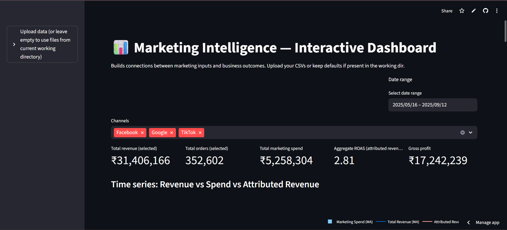
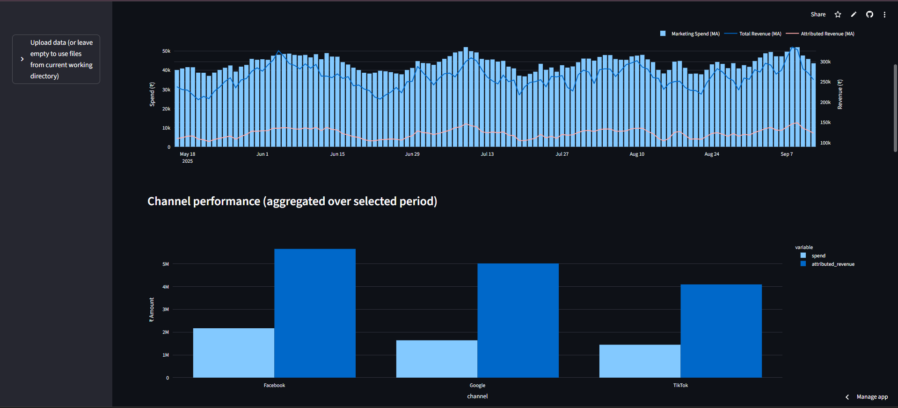

# 📊 Marketing Intelligence Dashboard

An interactive BI dashboard built with **Streamlit** to analyze how marketing activity (Facebook, Google, TikTok) impacts business outcomes (orders, revenue, profit).

This project was created as part of an **assessment task**.

---

## 🚀 Features

- Load and combine datasets from **Facebook, Google, TikTok, Business KPIs**
- Explore key marketing and business metrics:
  - Spend, Impressions, Clicks, Revenue
  - Orders, Customers, Gross Profit, COGS
- Interactive filters by **date, channel, campaign, state**
- Visualizations: time series, bar charts, KPIs
- Automated + manual insights
- Hosted on Streamlit Cloud

---

## 📂 Project Structure

```
.
├── app.py              # Main Streamlit app
├── business.csv        # Business KPIs dataset
├── facebook.csv        # Facebook marketing dataset
├── google.csv          # Google marketing dataset
├── tiktok.csv          # TikTok marketing dataset
├── requirements.txt    # Python dependencies
└── README.md
```

---

## ⚙️ Setup & Installation

### 1️⃣ Clone the repository

```bash
git clone https://github.com/Nidhin-jyothi/LifeSight-Task-1.git
```

### 2️⃣ Create & activate virtual environment

```bash
# Create environment
python -m venv env

# Activate (Windows PowerShell)
.\env\Scripts\Activate.ps1

# Activate (Linux/Mac)
source env/bin/activate
```

### 3️⃣ Install dependencies

```bash
pip install -r requirements.txt
```

### 4️⃣ Run the Streamlit app

```bash
streamlit run app.py
```

---

## 📸 Screenshots

- Dashboard Overview  
  
- Campaign Performance  
  

---

## 🌐 Deployment

The app is deployed on Streamlit Cloud.

👉 **Live Demo**